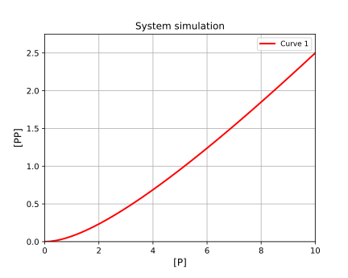

# Homodimer formation simulation


[Return to tutorials](tutorial.md)
 
Homodimer formation is a very simple, with only one species present, two units of which bind together to make one of a new species (dimer). Dissociation of the dimer then makes two monomers.  
Example code is available here: [https://github.com/stevenshave/pybindingcurve/blob/master/example_homodimer_formation_simulation.py](https://github.com/stevenshave/pybindingcurve/blob/master/example_homodimer_formation_simulation.py)

First, we perform the standard imports:
```
import numpy as np
import pybindingcurve as pbc
```
Define our system, homodimer formation has only p (protein, or monomer concentration) and kdpp (the dissociation constant of the dimer). We can choose to work in a common unit, typically nM, or µM, as long as all numbers are in the same unit, the result is valid.  We assume µM for all concentrations bellow:
```
system_parameters = {"p": np.linspace(0, 10), "kdpp": 10}
```
Make a pbc BindingCurve defined by the 'homodimer formation' binding system:
```
mySystem = pbc.BindingCurve("homodimer formation")
```
We can now add the curve to the plot and show it:
```
mySystem.add_curve(system_parameters)
mySystem.show_plot()
```
This produces the following simulation plot of the theoretical experiment. It is theoretical as monomer is titrated in, with no dimer present, something not achievable, although it could be done in reverse:



[Return to tutorials](tutorial.md)
